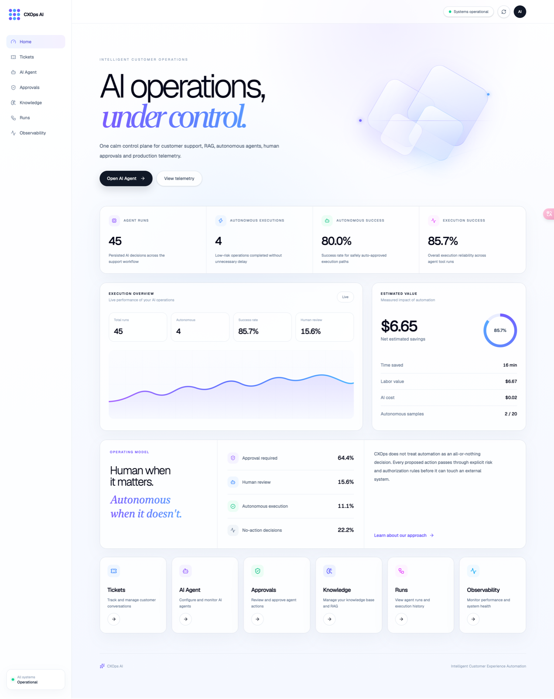
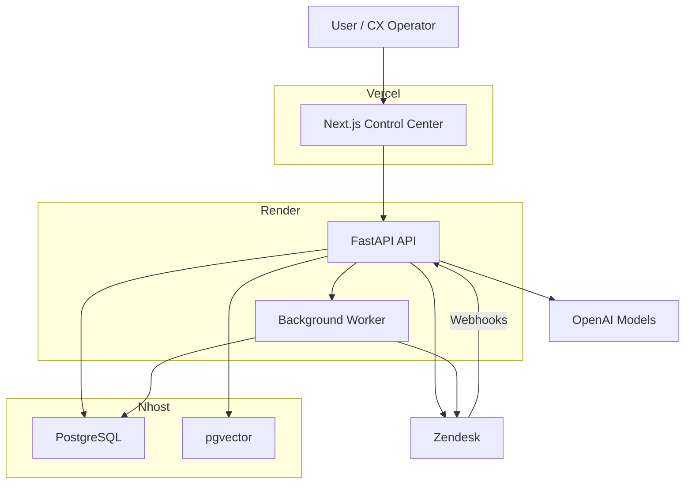
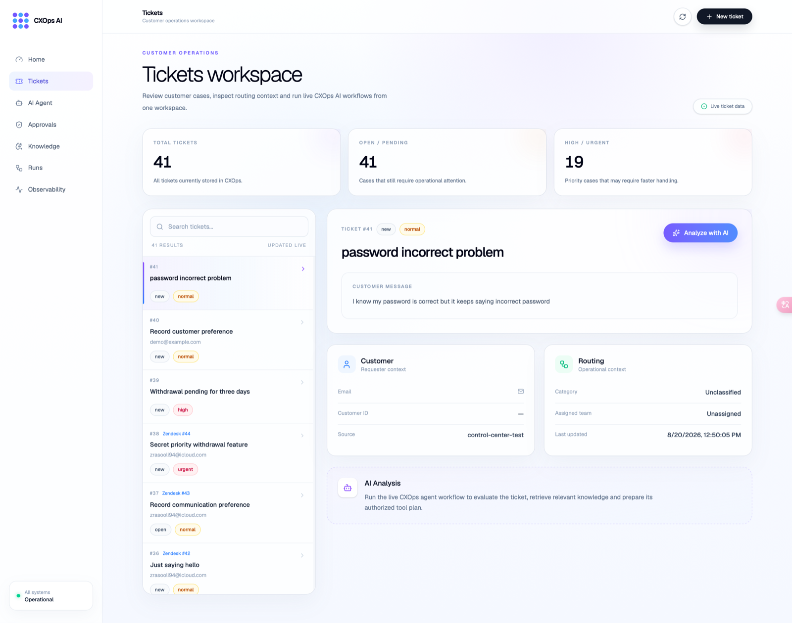
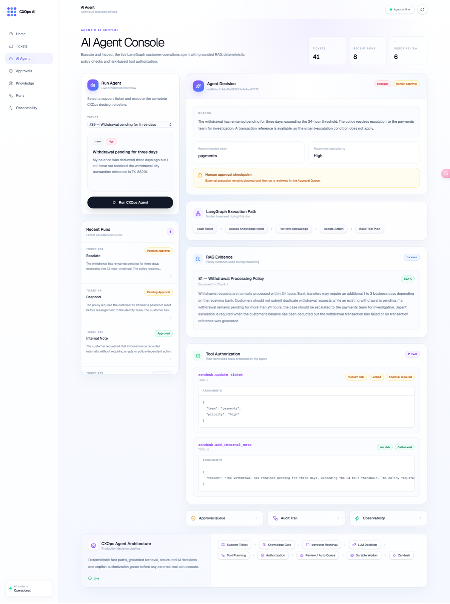
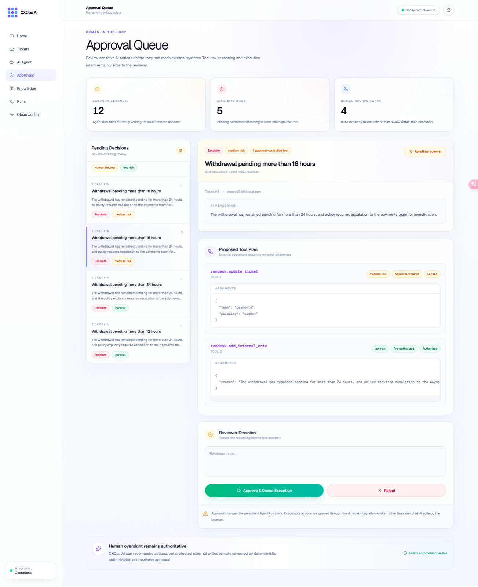
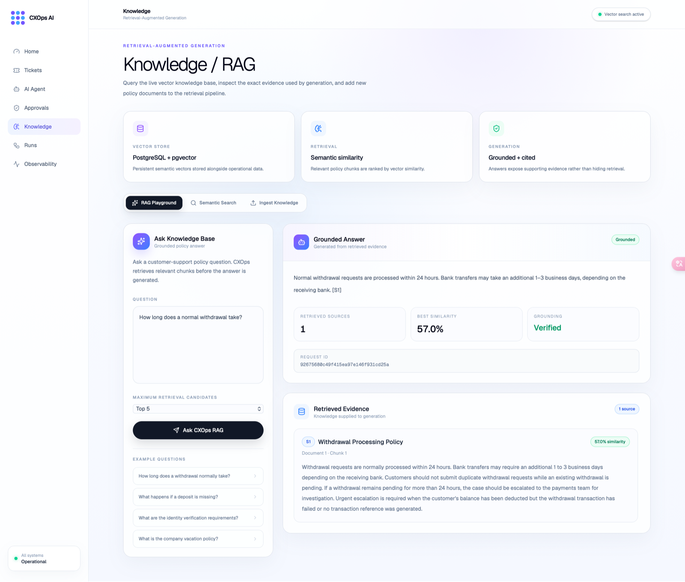
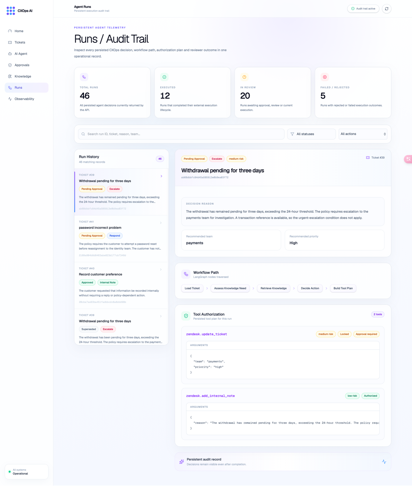
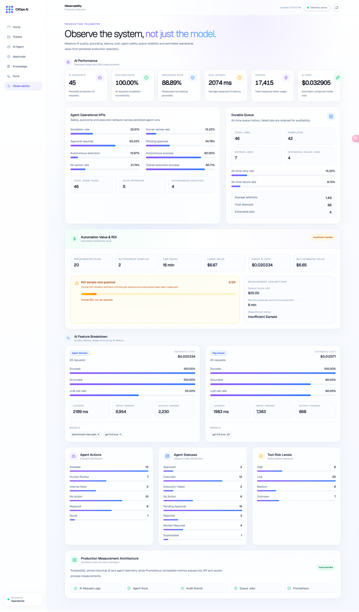

# CXOps AI

### Intelligent Customer Experience Automation & RAG Platform

CXOps AI is a production-style **Agentic AI customer experience platform** that combines autonomous AI workflows, Retrieval-Augmented Generation (RAG), human-in-the-loop approvals, Zendesk integration, durable background execution, and AI observability.

It is designed to demonstrate how AI agents can safely operate inside a real customer-support environment — not just generate chatbot responses.

### Live Demo

**Frontend:** https://cxops-ai.vercel.app

<p align="center">
  
</p>

---

## Overview

CXOps AI was built as an end-to-end AI engineering portfolio project focused on real-world customer experience automation.

The platform can:

- ingest customer support tickets
- analyze customer intent and operational context
- retrieve trusted knowledge using RAG
- select an appropriate support action
- determine whether that action can execute autonomously
- require human approval for higher-risk actions
- execute approved actions against Zendesk
- record complete audit trails
- monitor AI latency, cost, reliability, and workflow outcomes

The system deliberately separates **LLM reasoning from operational authorization**.

The model can recommend an action, but deterministic application policies decide whether that action is allowed to execute.

---

# Core Capabilities

## Agentic AI Workflows

CXOps AI analyzes customer-support cases and produces structured decisions such as:

- `respond`
- `route`
- `escalate`
- `internal_note`
- `human_review`
- `no_action`

Agent decisions include:

- action
- reasoning
- priority
- suggested team
- generated response
- RAG evidence
- workflow path
- planned tool execution
- approval requirements

Low-risk operations can execute automatically.

Higher-risk actions are routed through explicit human approval.

---

## Risk-Aware Tool Authorization

Tools have authorization policies independent of the language model.

Examples:

| Tool | Risk | Execution Policy |
|---|---|---|
| `none` | Low | Automatic |
| `human.review` | Low | Automatic |
| `zendesk.add_internal_note` | Low | Automatic |
| `zendesk.update_ticket` | Medium | Approval required |
| `zendesk.send_reply` | High | Approval required |

This prevents the LLM from granting itself operational permission.

---

## Retrieval-Augmented Generation

CXOps AI includes a complete RAG pipeline for grounding support decisions in trusted knowledge.

```text
Document
   ↓
Validation
   ↓
Text Extraction
   ↓
Chunking
   ↓
OpenAI Embeddings
   ↓
PostgreSQL + pgvector
   ↓
Semantic Retrieval
   ↓
Grounded AI Response
```

Supported ingestion includes:

- PDF
- TXT
- Markdown
- manually created knowledge documents

The retrieval layer includes:

- vector similarity search
- configurable similarity thresholds
- adaptive source selection
- source citations
- duplicate-document protection
- prompt-injection protection
- grounded refusal behavior when evidence is insufficient

---

## Zendesk Integration

CXOps AI integrates with Zendesk using OAuth and webhook-based ticket events.

Implemented capabilities include:

- Zendesk OAuth authorization
- access-token refresh
- ticket retrieval
- ticket creation
- ticket updates
- ticket comments
- ticket synchronization
- customer lookup
- webhook processing
- webhook signature verification
- idempotent event handling
- autonomous internal-note execution
- approval-based external actions

The production integration has been tested with real Zendesk tickets and webhook events.

---

## Human-in-the-Loop Approval

Actions that can materially affect customers require authorization before execution.

The Approval Queue allows an operator to:

- review the AI decision
- inspect the reasoning
- inspect retrieved RAG evidence
- review the proposed customer response
- inspect the planned tool
- add reviewer notes
- approve execution
- reject execution

Agent runs retain their complete approval history for auditability.

Newer analyses can also supersede older pending decisions for the same ticket, preventing duplicate pending approvals.

---

## Autonomous Execution

CXOps AI supports controlled autonomous actions where the operational risk is low.

For example:

> "Please note that I prefer email communication. No reply is necessary."

can be classified as a record-only request.

The agent can then:

```text
Analyze ticket
      ↓
Determine no external answer is required
      ↓
Select internal_note
      ↓
Authorize low-risk tool
      ↓
Queue execution
      ↓
Background worker
      ↓
Add Zendesk internal note
      ↓
Record execution result
```

This workflow has been validated end-to-end against the production Zendesk integration.

---

# Durable Background Jobs

External operations are executed through a durable integration-job queue rather than directly inside API requests.

Jobs support:

- pending state
- processing state
- retries
- configurable maximum attempts
- exponential/backoff-style retry handling
- completed state
- permanent failure state
- execution timestamps
- error recording
- deduplication keys

Failed jobs are deliberately retained instead of deleted so operational failures remain auditable.

---

# Safety Boundaries

CXOps AI implements several protections around autonomous execution.

A Zendesk action cannot enter the external execution queue unless:

1. the Agent Run exists
2. the local Ticket exists
3. the ticket contains an external target
4. the external Zendesk ID is valid

Local demo tickets therefore cannot accidentally reach Zendesk.

Blocked external execution attempts are recorded as audit events instead of being silently discarded.

---

# AI Observability

The platform records AI request telemetry including:

- feature
- model
- latency
- prompt tokens
- completion tokens
- total tokens
- estimated AI cost
- success/failure
- timestamps

The observability workspace exposes operational metrics for both AI requests and agent workflows.

---

## Agent KPIs

Tracked agent metrics include:

- total agent runs
- autonomous execution rate
- autonomous success rate
- human approval rate
- human review rate
- no-action rate
- execution success rate
- action distribution
- risk distribution
- workflow status distribution

Queue metrics are explicitly treated as **all-time operational history**.

Historical failed jobs are retained for auditability.

---

## ROI Measurement

CXOps AI includes an ROI measurement layer estimating:

- autonomous executions
- estimated minutes saved
- estimated support labor value
- AI execution cost
- estimated net value

The system deliberately avoids reporting formal ROI until a minimum autonomous-execution sample size is reached.

This prevents small-sample results from being presented as meaningful business evidence.

---

# Evaluation

The project includes dedicated evaluation workflows for both RAG and agent behavior.

### RAG Evaluation

Validated scenarios cover:

- retrieval quality
- answer correctness
- grounding
- citations
- refusal behavior
- prompt-injection resistance

Current evaluation suite:

```text
6 / 6 scenarios passing
```

### Agent Evaluation

The agent benchmark evaluates:

- action selection
- knowledge retrieval decisions
- tool selection
- approval policy
- safe autonomous behavior
- no-action behavior
- review routing

Current benchmark:

```text
12 / 12 scenarios passing
```

Repeated evaluation:

```text
60 / 60 runs passing
```

These results represent the project's defined evaluation scenarios rather than a claim of universal model accuracy.

---

# Production Architecture



### Production Deployment

| Layer | Platform |
|---|---|
| Frontend | Vercel |
| API | Render |
| Background Worker | Render |
| PostgreSQL | Nhost |
| Vector Database | PostgreSQL + pgvector |
| LLM / Embeddings | OpenAI |
| CX Integration | Zendesk |

The free Render deployment may sleep after inactivity, so the portfolio environment can experience cold starts.

---

# Control Center

The frontend provides dedicated operational workspaces for:

### Home

High-level AI operations overview and system status.

### Tickets

Customer support ticket exploration and AI analysis.

<p align="center">
  
</p>

### New Test Ticket

Safe local workspace for testing agent behavior without external execution.

### AI Agent

Interactive agent analysis including:

<p align="center">
  
</p>

- decision
- reasoning
- workflow path
- RAG evidence
- tool plan
- authorization state

### Approval Queue

Human authorization for protected AI actions.

<p align="center">
  
</p>

### Knowledge / RAG

Knowledge ingestion, semantic search, and grounded question answering.

<p align="center">
  
</p>

### Runs / Audit Trail

Read-only history of agent decisions and execution lifecycle.

<p align="center">
  
</p>

### Observability

AI latency, cost, reliability, agent KPIs, durable queue history, and ROI measurement.

<p align="center">
  
</p>

---

# Technology Stack

### AI / Agent Engineering

- OpenAI
- Agentic AI workflows
- LangGraph-style workflow orchestration
- Retrieval-Augmented Generation
- Prompt engineering
- structured LLM outputs
- tool authorization
- human-in-the-loop AI
- AI evaluation

### Backend

- Python 3.11
- FastAPI
- Pydantic
- SQLAlchemy
- Alembic
- asyncpg
- Prometheus metrics

### Data

- PostgreSQL
- pgvector
- vector embeddings

### Integrations

- Zendesk REST API
- Zendesk OAuth
- Zendesk webhooks
- HMAC webhook verification

### Frontend

- Next.js
- TypeScript
- React
- Tailwind CSS
- GSAP
- Lenis
- Lucide React

### Infrastructure

- Docker
- Docker Compose
- Vercel
- Render
- Nhost
- GitHub

### Quality

- Pytest
- Ruff
- ESLint
- TypeScript
- Gitleaks
- Alembic migrations

---

# Project Structure

```text
cxops-ai/
├── app/
│   ├── api/
│   │   └── routes/
│   ├── core/
│   ├── integrations/
│   ├── models/
│   ├── repositories/
│   ├── schemas/
│   ├── services/
│   └── main.py
│
├── alembic/
├── evals/
├── scripts/
├── tests/
├── docs/
│
├── frontend/
│   ├── src/
│   │   ├── app/
│   │   └── components/
│   └── package.json
│
├── docker/
├── compose.yaml
├── Dockerfile
├── requirements.txt
└── README.md
```

---

# Running Locally

## 1. Clone

```bash
git clone https://github.com/zrasooli94/cxops-ai.git
cd cxops-ai
```

## 2. Create Python environment

```bash
python3.11 -m venv .venv
source .venv/bin/activate
```

## 3. Install backend dependencies

```bash
pip install -r requirements.txt
```

## 4. Configure environment

Create:

```text
.env
```

Use `.env.example` as the reference.

Never commit real credentials.

## 5. Start PostgreSQL

```bash
docker compose up -d postgres
```

## 6. Run migrations

```bash
alembic upgrade head
```

## 7. Start API

```bash
python -m uvicorn app.main:app --reload
```

Backend:

```text
http://127.0.0.1:8000
```

## 8. Start background worker

In another terminal:

```bash
python -m scripts.worker
```

## 9. Start frontend

```bash
cd frontend
npm install
npm run dev
```

Frontend:

```text
http://localhost:3000
```

---

# Testing

Backend:

```bash
pytest -q
```

Python quality:

```bash
python -m ruff check app tests scripts alembic
```

Frontend:

```bash
cd frontend
npm run lint
npm run build
```

Database migrations:

```bash
alembic current
alembic heads
```

Secret scanning:

```bash
gitleaks git --redact --log-opts="--all" .
```

---

# Production Validation

The project has been validated across several real production workflows:

- cloud PostgreSQL + pgvector migrations
- Vercel → Render API communication
- production PDF knowledge upload
- Zendesk OAuth authorization
- Zendesk API access
- Zendesk webhook delivery
- durable worker execution
- autonomous Zendesk internal-note execution
- human approval workflow
- RAG evaluation
- agent evaluation
- Git history secret scanning

---

# Engineering Principles

CXOps AI was designed around several production AI principles:

**Ground before generating.**
Knowledge-sensitive responses retrieve trusted evidence before answering.

**Authorization is deterministic.**
The LLM does not decide whether it has permission to execute protected tools.

**Low-risk automation, high-risk approval.**
Autonomy is proportional to operational risk.

**External actions are durable.**
Integrations run through retryable background jobs rather than fragile request-time execution.

**Failures remain auditable.**
Failed jobs and superseded decisions remain visible.

**Measure AI systems beyond accuracy.**
Latency, cost, grounding, tool behavior, execution reliability, and estimated business value are observable.

---

# Current Status

CXOps AI is an actively developed portfolio project.

Core production workflows are implemented and deployed.

Planned future improvements include:

- mobile and tablet responsive navigation
- broader evaluation datasets
- additional CRM/ticketing integrations
- richer production tracing
- larger autonomous-execution ROI sample
- expanded operational analytics

---

# Author

**Zaker Hussain Rasooli**

Software Engineering · Artificial Intelligence · Agentic AI · RAG · Backend Engineering

Built as an applied AI engineering project focused on production-style customer experience automation.
